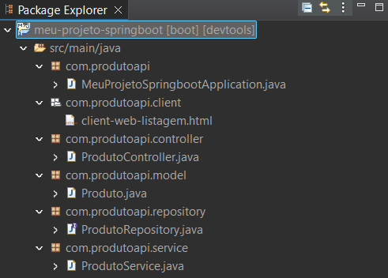
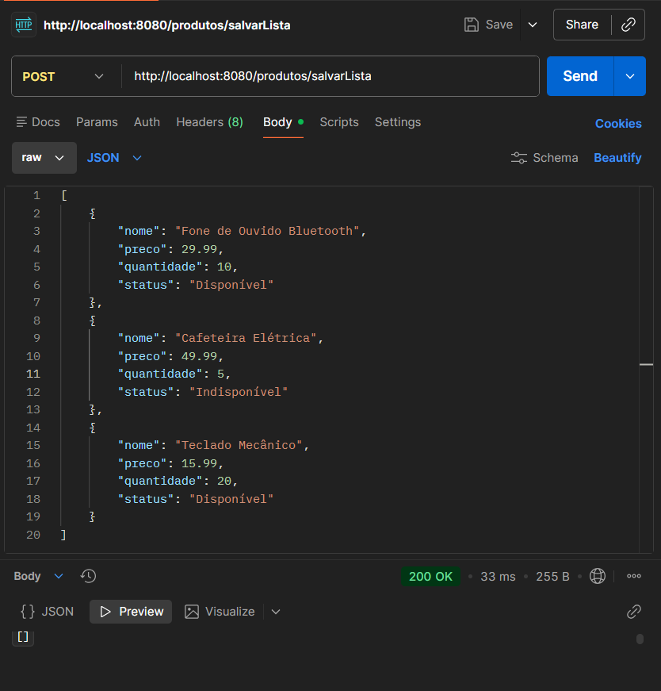
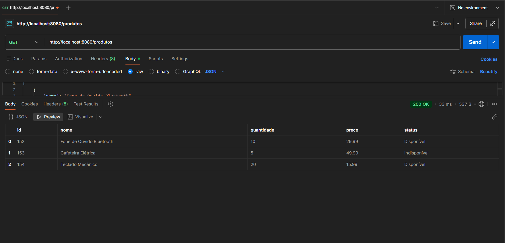
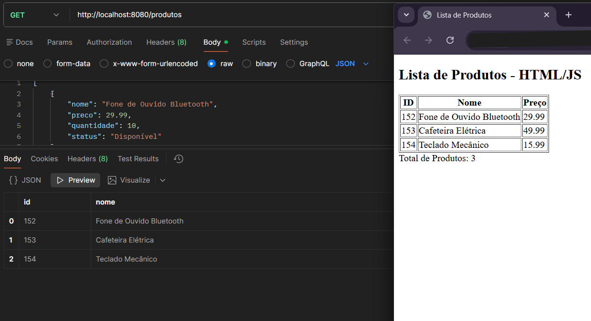

<h2> API Gerenciador de Produtos </h2> 
Este projeto é uma API RESTful desenvolvida para o gerenciamento eficiente de produtos, permitindo operações individuais e processamento em lote, integrada a uma interface web para visualização dinâmica.

<h3> 🛠 Tecnologias Utilizadas </h3> 
Java 22 e Spring Boot 3 como base do ecossistema.
Spring Data JPA para abstração da camada de dados.
SQLite para persistência de dados local e leve.
Maven para automação de build e dependências.
Fetch API (JS) para consumo assíncrono no frontend.

<h3> Organização do Projeto </h3>
A aplicação utiliza uma arquitetura em camadas para separar responsabilidades:

Controller: Define as rotas e gerencia as requisições HTTP.

Service: Centraliza a lógica de negócio e regras de validação.

Repository: Responsável pela comunicação direta com o banco de dados.

Model: Define a entidade Produto e suas restrições de persistência.

<h3> Cadastro em massa </h3>
Um dos pontos interessantes desta API é a capacidade de realizar adições em massa através do endpoint /salvarLista. Diferente de implementações convencionais que processam um item por vez, esta funcionalidade utiliza o método saveAll para otimizar o fluxo de escrita no banco de dados. Abordagem fundamental para cenários de alta demanda. Ao enviar um array de objetos JSON via Postman, o backend processa a coleção completa atribuindo IDs.

<h3> 📑 Endpoints da API </h3>
| Método | Endpoint | Funcionalidade |
| :--- | :--- | :--- |
| **GET** | `/produtos` | Lista todos os produtos cadastrados. |
| **GET** | `/produtos/{id}` | Busca detalhes de um produto específico. |
| **POST** | `/produtos` | Realiza o cadastro de um único item. |
| **POST** | `/produtos/salvarLista` | Cadastro em massa via lista de objetos. |
| **PUT** | `/produtos/{id}` | Atualiza um registro existente. |
| **DELETE** | `/produtos/{id}` | Remove permanentemente um produto do sistema. |

<h3> Como Executar o Projeto </h3>
Para rodar a aplicação localmente, siga os passos abaixo:
1. Clonar o repositório:
git clone https://github.com/lauradcode/API-Gerenciador-produtos.git
2. Compilar e instalar dependências:
mvn clean install
3. Iniciar a aplicação:
mvn spring-boot:run
4. Acesso:
A API estará ativa em http://localhost:8080. A interface web pode ser visualizada abrindo o arquivo client-web-listagem.html no seu navegador.

<h3> Integração Frontend e CORS </h3>
Foi desenvolvida uma interface utilizando HTML e JavaScript para mostrar a tabela final dos produtos na web. A comunicação ocorre por meio da Fetch API, que consome os endpoints da API para renderizar dinamicamente uma tabela de produtos. Para haver essa troca de informações entre backend e frontend, foi implementada a configuração de CORS (Cross-Origin Resource Sharing) no controlador principal, para não haver bloqueio do navegador.

 Estrutura Package Explorer 
  

 Adicionando produtos com POST
  

 Buscando a lista de produtos com GET
  

 Tabela na Web
  

